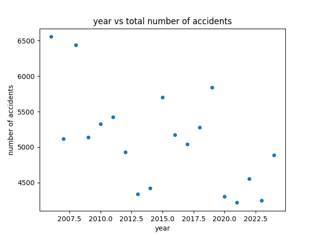
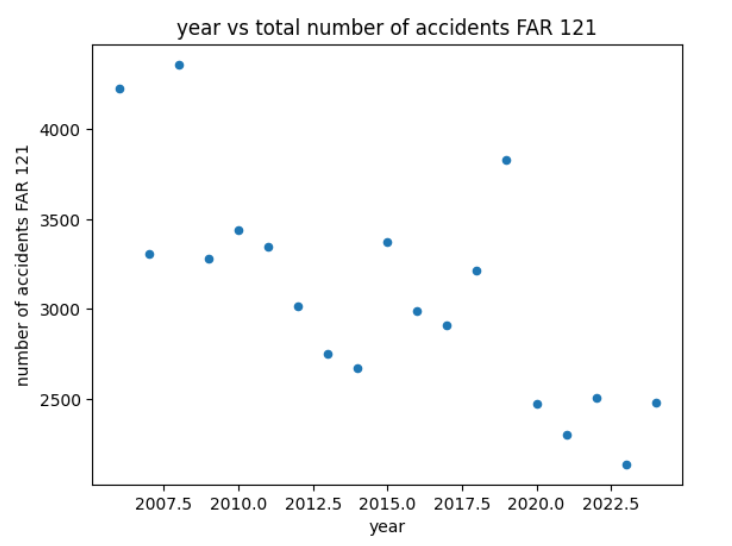
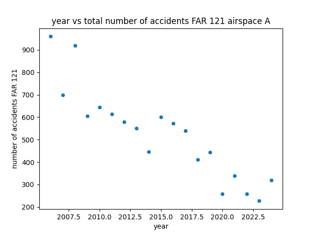
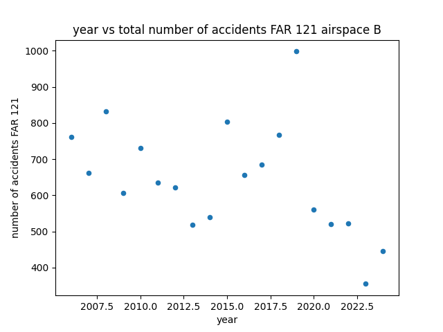
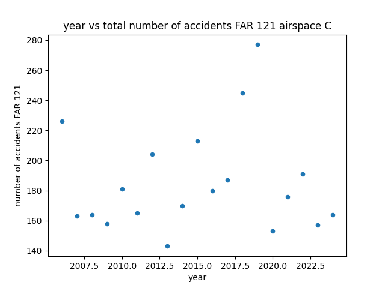
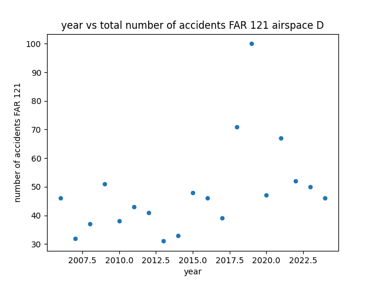
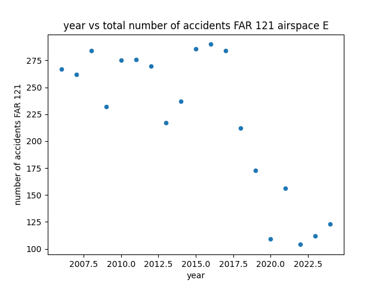
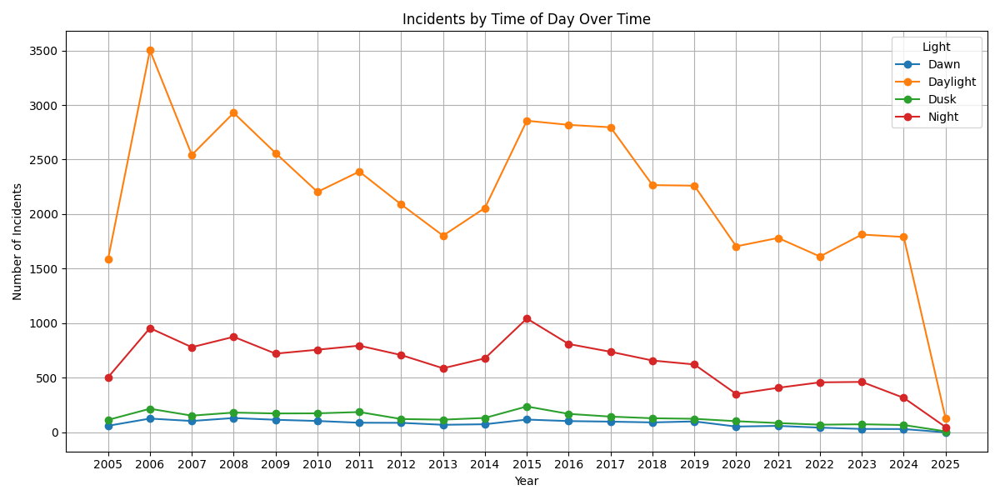
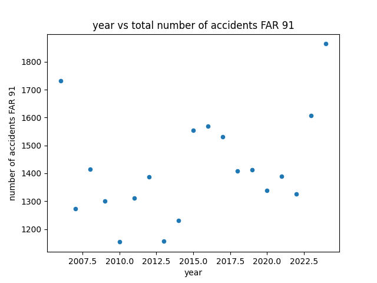
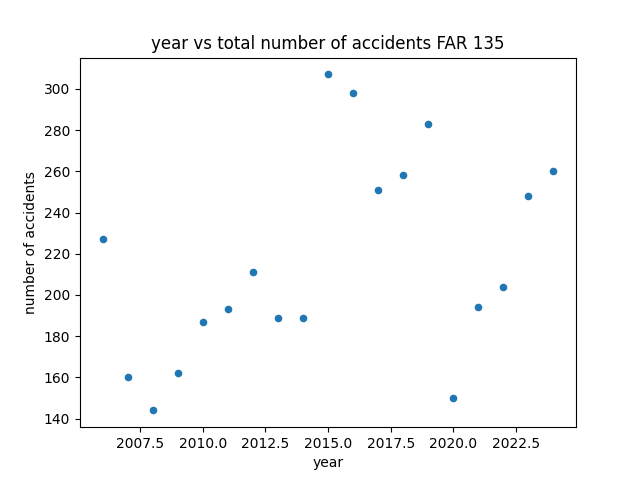

# Exploratory Data Analysis
First we began by exploring the data by looking at the following features:
- accidents over time
- accidents per state
- accidents in the top 3 states over time 
- accidents per country
- accidents by FAR 121 and Airspace Category
- accidents by different FAR parts
- accidents by time of day

## Accidents over Time
From the scatterplot, accidents appear to be decreasing over time, although it is not super clear and further investigation is needed. 

## Accidents per State
In accidents per state we can see that the top 3 states for accidents included California, Texas, and Florida. 

## Accidents per Top 3 States Over Time
In accidents per state we can see that the top 3 states for accidents have been decreasing over time, especially since the year of 2015, where accident rates where at their peak. 

## Accidents per Country
This dataset was of flights coming from the United States to a different country so it makes sense that the United States had the highest incident rate, followed by the Philippines

## Accidents by FAR 121 and Airspace Category

We examined how accidents under **FAR 121 (commercial operations)** were distributed across different types of airspace. Below are the scatterplots broken down by airspace classifications A through E.

### Overall Accidents Under FAR 121
This chart shows total accident counts for FAR 121, regardless of airspace.

### Accidents in Airspace A

### Accidents in Airspace B

### Accidents in Airspace C

### Accidents in Airspace D

### Accidents in Airspace E

## Accidents by Time of Day

We also examined when accidents occurred across different times of day. This plot helps highlight any trends associated with daylight vs night operations.

---

## Accidents by FAR Part

The Federal Aviation Regulations (FARs) categorize aviation operations into different parts. Below we show how accident counts differ across **Part 91**, **Part 121**, and **Part 135** operations.

### Part 91: General Aviation (non-commercial)

---

### Part 121: Scheduled Air Carriers (e.g., airlines)

---

### Part 135: On-Demand Charter, Air Taxi, etc.

