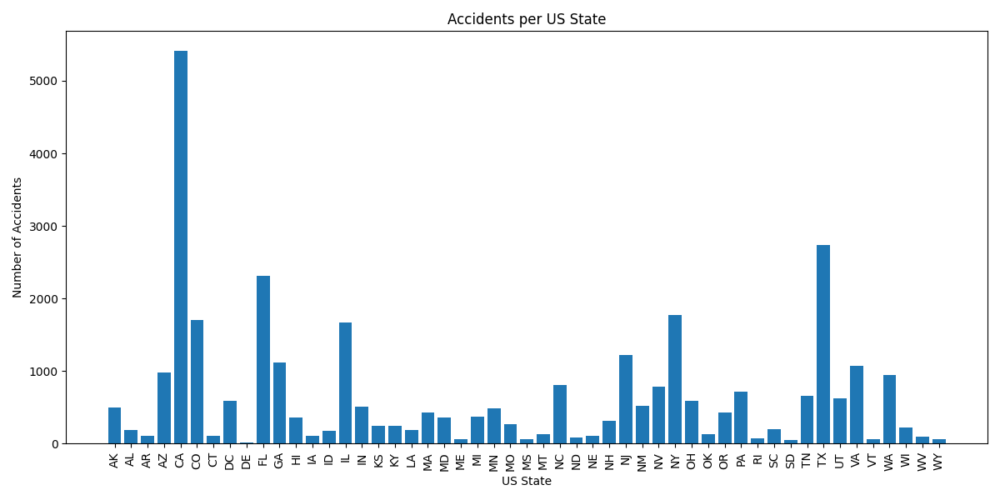
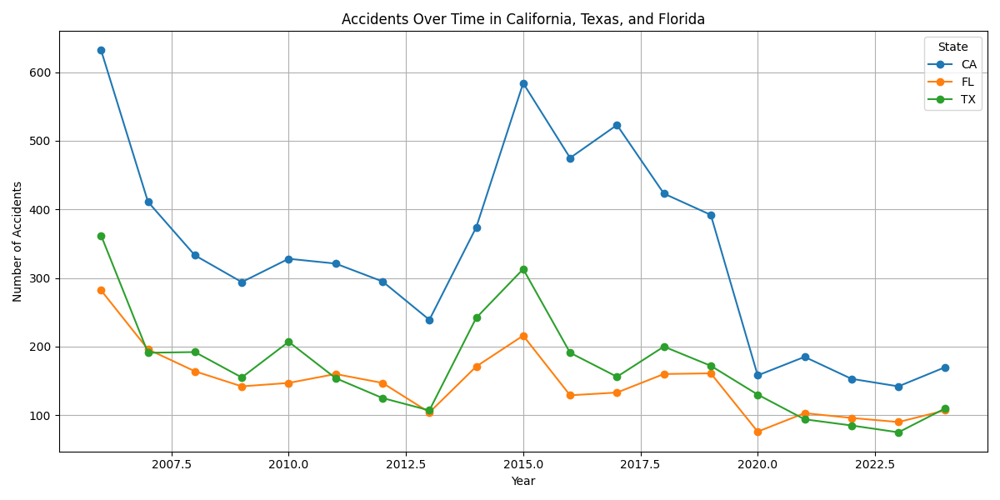
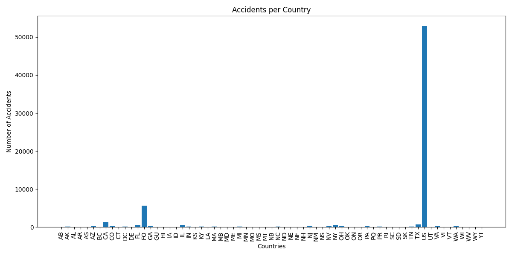

# Exploratory Data Analysis
First we began by exploring the data by looking at the following features:
- accidents per state
- accidents in the top 3 states over time 
- accidents per country
- 
## Accidents per State
In accidents per state we can see that the top 3 states for accidents included California, Florida, and Texas. 

## Accidents per State
In accidents per state we can see that the top 3 states for accidents included California, Florida, and Texas. 

## Accidents per Country
This dataset was of flights coming from the United States to a different country so it makes sense that the United States had the highest incident rate, followed by the Philippines

