# Modeling and Results

To better understand trends in aviation accidents, we applied both linear regression models (OLS) and seasonal time series models (SARIMA). The OLS models were used to examine overall trends in accident counts over time, such as whether incidents have increased or decreased by year or month. In contrast, SARIMA models were used to forecast future accident patterns by accounting for both trend and seasonality. These models were applied separately to different regulatory categories (FAR 91, FAR 121, and FAR 135) to explore how accident dynamics differ across types of operations.

## OLS Models

- If we do linear regression on the yearly number of incidents, with year as the "predictor" and "number of accidents" as the target, from 2006 through 2024, the accidents decrease over time ($p = 0.023$). The $R^2$ value is $0.337$, adjusted $R^2$ is $0.286$. Much of the variance is unexplained in this plot, so we explore this further below. 

  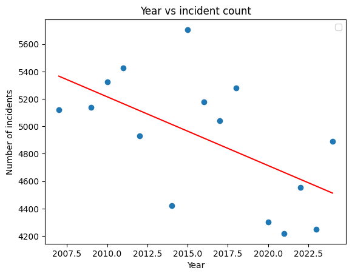

 - If we redo this considering only data from commercial flights (FAR Part 121), there is much less unexplained variance ($R^2 = 0.696$), and there is still a clear decreasing trend over time ($p=0.000$).

          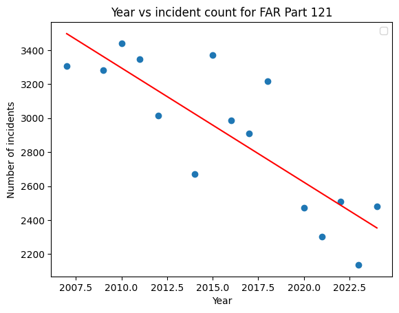

- If, still within FAR Part 121, we further restrict incidents according to their "Primary Problem", then:
  - There are no statistically significant trends for:
    - "Procedure" ($\sim 300$ incidents per year, but not introduced as a category until 2009)
    - "Weather" ($\sim 100$ incidents per year)
    - "Environment - Non Weather Related" ($\sim 75$ incidents per year)
    - "ATC Equipment / Nav Facility / Buildings" ($\sim 50$ incidents per year),
    - "Chart or publication ($\sim 50$ incidents per year)
    - "Airspace structure ($\sim 20$ incidents per year)
    - "Software and Automation" ($\sim 20$ incidents per year)
  - Incidents due to "Human Factors" are decreasing yearly ($p = 0.024$, $\sim 1000$ incidents per year, coefficient of year is $-22$).

    

      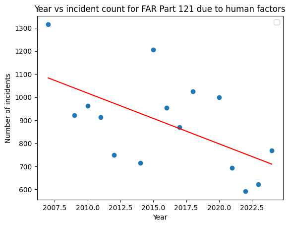
    

  - Incidents due to "Aircraft" are decreasing yearly ($p = 0.014$, $\sim 1000$ incidents per year, coefficient of year is $-24.78$),

    

      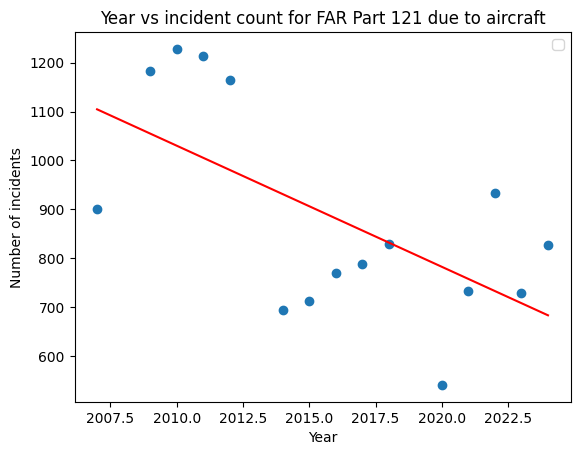
    

  - Incidents due to "Company Policy" are decreasing yearly ($p = 0.000$, coefficient of year is $-17.23$). On average there were around 100 incidents per year due to "Company Policy", but by 2023 they decreased to effectively zero. This is one of the most significant part of this particular dataset; it seems to suggest that companies are actually responding quite well to feedback, especially considering that the ASRS data is anonymised. The variance is fairly well explained by the linear fit ($R^2 = 0.710$). 

    

      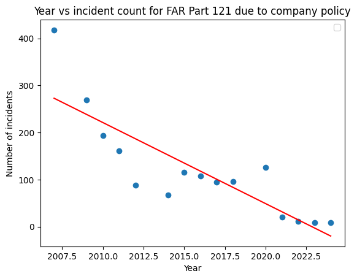
    

  - At a guess, only 50% of incidents report information about the airspace, but if we restrict incidents to airspace, then:
    - For Classes A, B, E airspace, and for those with airspace not specified, there is clear decrease in the incidents over time.

      <table>
        <tr>
          <td align="center">
            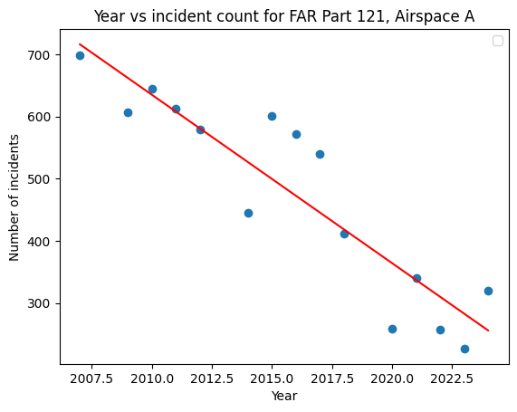 
            Airspace A
          </td>
          <td align="center">
            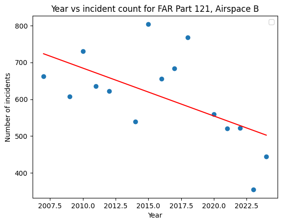 
            Airspace B
          </td>
        </tr>
        <tr>
          <td align="center">
            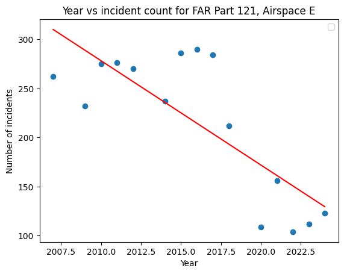 
            Airspace E
          </td>
          <td align="center">
            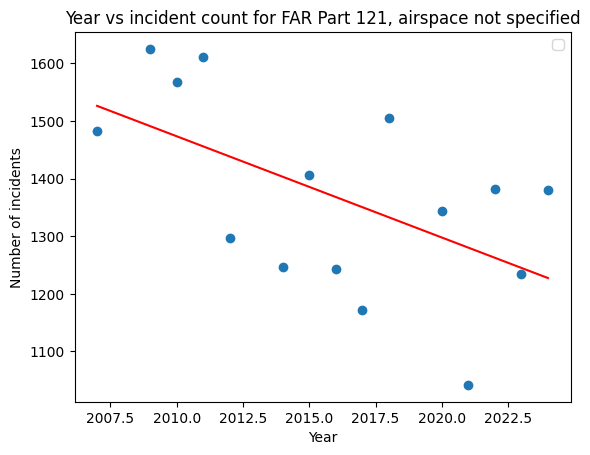 
            No Airspace
          </td>
        </tr>
      </table>

    - For Class C airspace, there is no statistically significant trend. 
    - For Class D airspace, there is an increase in incidents over time, but it is only marginally significant ($p = 0.054$), on average around 50 incidents per year.

      

        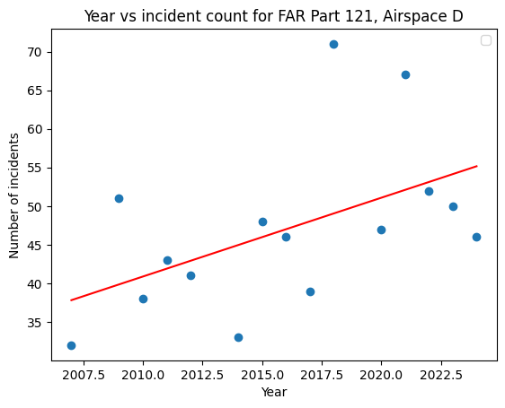
      

- If instead of commercial flights, we consider FAR Part 91 (general aviation, non-commercial flights), incident counts are increasing over time ($p = 0.016$). Because reporting incidents for Part 91 flights is likely less standardised than for commercial flights, it is possible the increasing trend here is the result of increased reporting (or just an increased number of flights taken).

 
  

          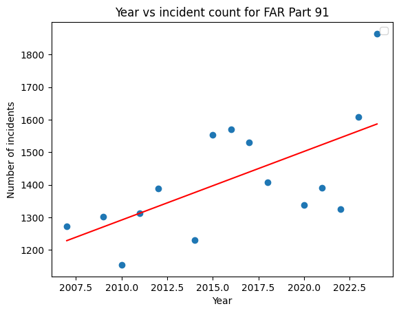
  

  
  
- If we restrict to Far Part 135 (other types of commercial flights such as charter flights), there is no statistically significant trend. There is much less data for Part 135 than 121 and 91 (about 60000 Part 121 incidents,  27000 Part 91, 4000 Part 135, 1000 other).

- If we do an ordinary linear regression with "year" as a feature variable,  months as categorical variables and January as the baseline, with "number of incidents per month" for FAR Part 121 as the target variable, then generally there are more incidents in July than January, and fewer incidents in February than January, and with all other months falling somewhere in-between. The only statistically significant month is February which has a negative coefficient (less accidents in February versus January), (this is likely exaggerated by February having the least number of days). The number of incidents month-to-month is more variable than per-year, so our adjusted $R^2$ is much smaller ($0.317$), though if we don't include the months as categorical variables the $R^2$ is extremely small. Instead of one-hot-encoding the months, we also tried cyclically encoding the months, meaning that we try to find the best curve of the form

$$y(t) = \beta_0 + \beta_1 t + \sum_{k=1}^{K} \left[ \alpha_k \sin\left(2\pi k \cdot \frac{t}{12} \right) + \gamma_k \cos\left(2\pi k \cdot \frac{t}{12} \right) \right]
$$ 

fitting the data, where time $t$ is measured in years, and $K$ is to be chosen. From the one-hot encoding attempt, we expect a dip in February and a peak in mid-summer (July), so $K=2$ should be enough to capture these seasonal effects (or any effect with a period of 6 months). The best curve fitted to the training data is shown below. 

          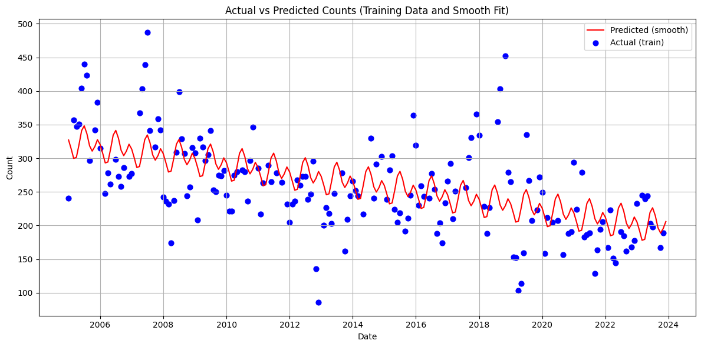

With this setup there is clearer evidence of seasonal effects; the parameter $\gamma_2$ is not zero ($p= 0.009$). From the picture we can see there is a lot of unexplained variance; the adjusted $R^2$ is $0.315$. As might be expected by parameter counting, using $K=6$ is enough to match the $R^2$ and adjusted $R^2$ values of one-hot encoding ($0.362$ and $0.317$), but the picture below shows only a small improvement to accuracy. 

          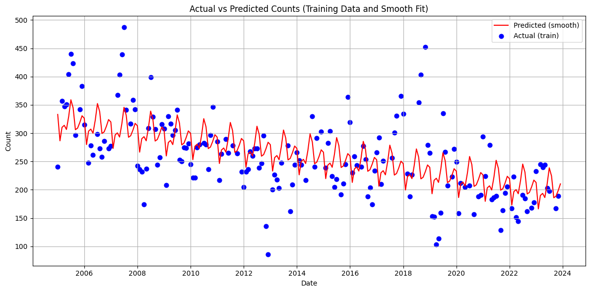

- If we specialise instead to Part 91 flights, with one-hot encoding of months as categorical variables, then almost every non-winter month has a statistically significant positive coefficient (this is likely because far fewer Part 91 flights occur during the winter, whereas Part 121 flights continue throughout winter).

## SARIMA Model Outputs
We used SARIMA models because they are well-suited for time series data that exhibit trends and non-stationarity. The plots below show the results of a SARIMA model applied to historical aviation incident data. In the SARIMA forecasts below, the blue line represents actual data from approximately 2006 up until 2024, and the green line shows the forecast into 2024 and beyond. The shaded gray area reflects the 95% confidence interval of the forecast.

### SARIMA 121
Here, we conducted the SARIMA with part 121. While the early years (e.g., 2005–2009) saw higher and more volatile accident counts, the SARIMA model predicts that future rates will remain comparatively lower and more stable. This may suggest improvements in safety protocols or technology, though further analysis would be needed to confirm causal factors.
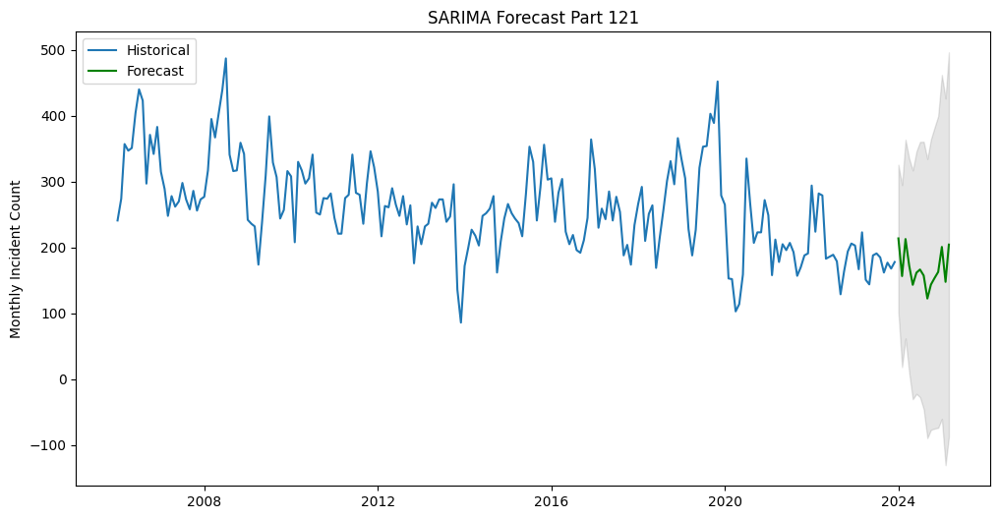  
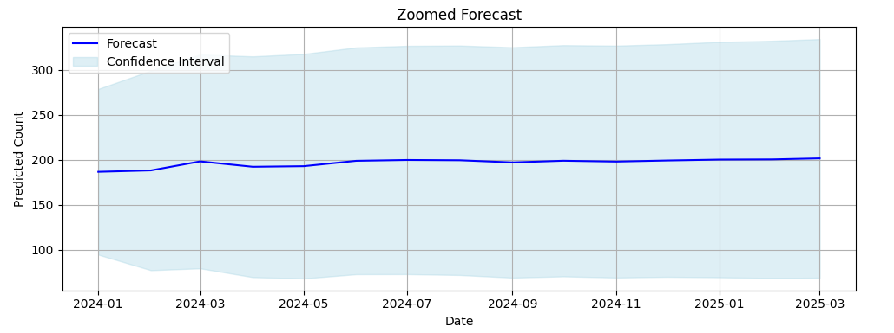  

With a five year forecast, it appears that accident rates tend to stay relatively low.
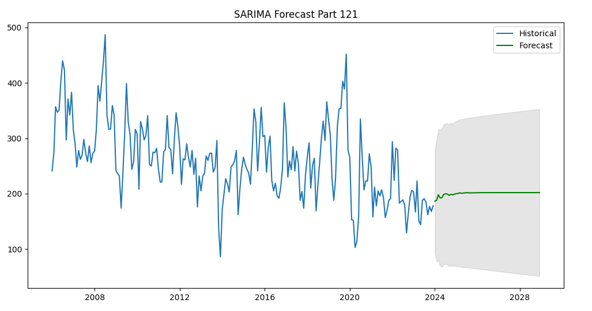 

## SARIMA 121 in 5 years
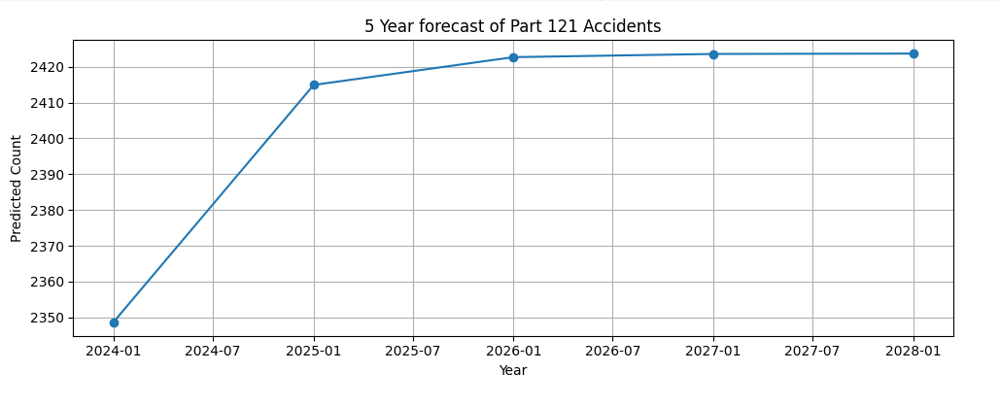  

## SARIMA 91 
Here, we conducted the SARIMA with part 91. While the early years (e.g., 2005-2009) saw higher and more volatile accident counts, the SARIMA model predicts that future rates will remain comparatively lower and more stable. This may suggest improvements in safety protocols or technology, though again, further analysis would be needed to confirm causal factors.
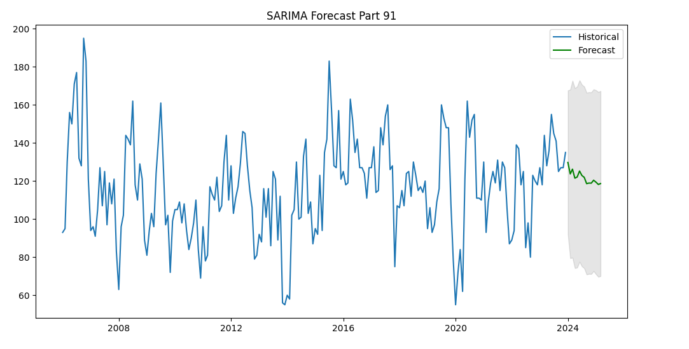 

With a five year forecast, it appears that accident rates tend to stay relatively low.
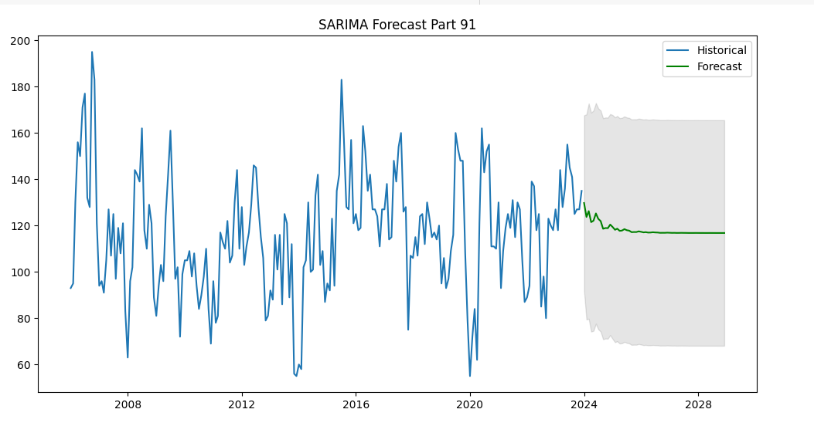 

## Conclusion

# Recommendations
For commercial (FAR Part 121) flights, the only airspace with some evidence for an increasing trend of incidents was airspace D. This suggests that factors unique to this airspace could warrant further investigation for safety improvements. For example, one factor that distinguishes airspace D from airspaces A, B, C is that primary airports in airspace D do not provide radar services, so one recommendation could be improved training in settings without radar services. Another factor could be that reduced ATC staffing in smaller airports using airspace D could lead to more incidents, so another suggestion could be reallocation of some ATC to airspace D airports, if possible. Of course, given the dataset reports only incidents but not incident *rates*, further work would be needed using other datasets to check whether the causes of the incidents increasing is not explained for a simple increase in the amount of flights.  

To be a little more precise, although the increasing trend of incidents in airspace D is marginal ($p= 0.054$), we can split the data further according to 'Light', which has five categories: 'Daylight', 'Night', 'Dusk', 'Dawn', and 'Not Specified'. Looking at a graph of incidents separated by 'Light' over time shows that the 'Daylight' and 'Not Specified' proportions are nearly reflections of each other, suggesting that most incidents recorded as 'Not Specified' are likely those which occured in 'Daylight' or for which 'Light' was not a contributing factor. 

